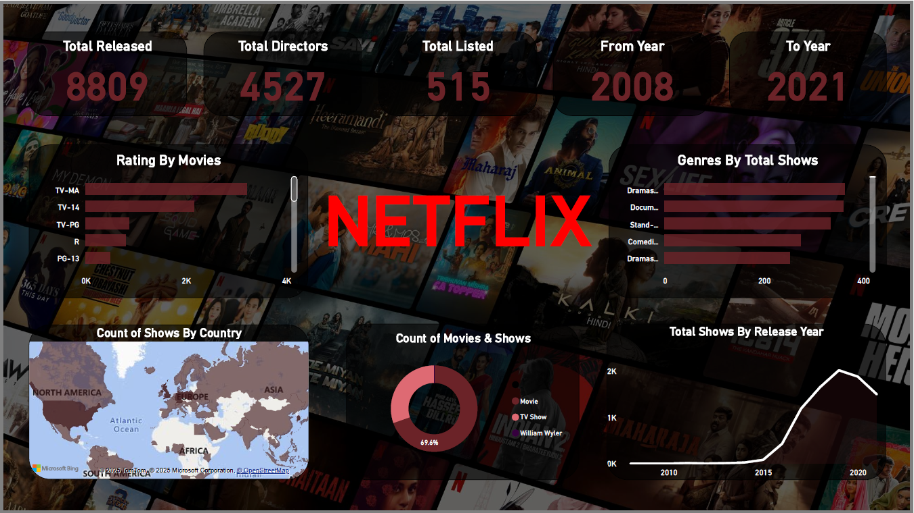

# Project Title: Sales Insights Netflix Dashboard – Power BI Project
The Netflix Insights Dashboard is an interactive Power BI project designed to analyze global content released on Netflix. Using the netflix_titles.csv dataset, this dashboard uncovers trends in release years, countries, genres, ratings and show types.
It provides an intuitive, visual understanding of the platform’s content library and supports insights related to global entertainment consumption.
This project is ideal for Data Analytics, Business Intelligence and Power BI portfolio demonstrations

## Project Purpose / Problem Statement
Netflix hosts thousands of movies and TV shows across several decades, regions and genres. However, raw data alone doesn’t reveal:
* How content releases evolved over the years
* Which genres dominate the catalog
* What ratings are most common
* Director and cast distribution
This dashboard transforms raw data into an easy-to-understand visual story that helps identify historical patterns, content distribution, and viewer-oriented insights.

## Project Files
| File Name                 | Description                           |
| ------------------------- | ------------------------------------- |
| **NetflixDashboard.pbix** | Complete Power BI dashboard file      |
| **Netflix.png**           | Screenshot preview of final dashboard |
| **netflix_titles.csv**    | Cleaned dataset used for analysis     |
| **README.md**             | Project documentation                 |

## Dataset Overview
The dataset contains **8,808 rows** and the following columns:
| Column Name     | Description                                 |
|------------------|---------------------------------------------|
| `show_id`        | Unique ID for each show                     |
| `type`           | Movie or TV Show                            |
| `title`          | Name of the content                         |
| `director`       | Director(s) of the content                  |
| `cast`           | Main cast members                           |
| `country`        | Country of origin                           |
| `date_added`     | Date the show was added to Netflix          |
| `release_year`   | Year the content was released               |
| `rating`         | Age rating (e.g., PG, TV-MA, R)             |
| `duration`       | Duration (minutes for movies, seasons for TV shows) |
| `listed_in`      | Genres/categories                          |
| `description`    | Short summary of the content                |

## Data Cleaning / Preprocessing
Performed in Power BI Power Query:
* Removed empty records and duplicates
* Handled missing values in country, director, cast fields
* Split multi-genre fields for visualization
* Converted date fields into usable date/time formats
* Extracted numeric values from duration column
* Created calculated columns for enhanced analysis

## Dashboard Features
### KPIs Displayed:
- **Total Shows**
- **Total Directors**
- **Total Genres (Listed In)**
- **Content Range**: From earliest to latest release year

### Visual Insights:
- 🎭 **Genres by Total Shows**
- 🎬 **Ratings by Movies**
- 🌍 **Count of Shows by Country**
- 🎥 **Count of Movies vs. TV Shows**
- 📅 **Content Added Over Time (Release Year)**

### Filters & Slicers:
- Content Type (Movie / TV Show)
- Country
- Release Year
- Rating
- Genre (Listed In)

## Dashboard Preview

## Key Insights
* USA, India, and the UK dominate Netflix's content addition
* Drama, Comedy, and Action are the most popular genres
* Majority of Netflix content is released after 2010, showing exponential growth
* Movies significantly outnumber TV Shows in the dataset
* "TV-MA" is the most frequent maturity rating
* Many titles lack director/cast information, indicating metadata gaps

## Tools & Technologies
- **Power BI** – Visualization & Dashboard Creation
- **Power Query** – Data Cleaning
- **CSV Dataset** – Raw data source
- **DAX Measures** – KPIs and advanced calculations
- **GitHub** – Code & project version control

## Download Files
**Download Dashboard (PBIX):** https://github.com/sunilprajapati832/NetflixPrimeDashboard/blob/main/NetflixDashboard.pbix
**Download Dataset (CSV):** https://github.com/sunilprajapati832/NetflixPrimeDashboard/blob/main/netflix_titles.csv

## How to Use This Project
- Download the .pbix file
- Open in Power BI Desktop
- Load the dataset (if needed)
- Explore all visualizations & filters

## Why This Project Is Valuable for Recruiters
* Demonstrates real business intelligence skills
* Shows ability to work with metadata-heavy datasets
* Highlights advanced PowerBI capabilities (maps, KPIs, DAX, charts)
* Strong storytelling and dashboard UI skills
* Perfect for Data Analyst, BI Analyst, Power BI Developer roles

## License
This project is licensed under the **MIT License (Attribution Required)**.  
If you use or share this work, please credit **Sunil Prajapati** and include a link to this repository.  

## Author
**Sunil Prajapati**  
If you found this project interesting, let’s connect!  
 
